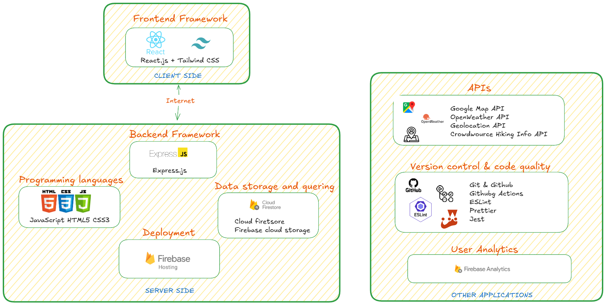

# TECHNOLOGY STACK FOR THE HIKING LOGBOOK WEB APPLICATION

The Hiking Logbook is built using a modern, integrated technology stack designed to streamline development, ensure scalability, and deliver a seamless user experience. Each technology has been carefully chosen to align with the project requirements for functionality, maintainability,and performance.

# 1. Overview

The Hiking Logbook is a **single-page web application** where the frontend (React \+ Tailwind) communicates directly with Firebase's backend services via Firebase SDKs. This eliminates the need for a self-hosted backend,reducing infrastructure complexity. User actions, such as logging a hike or checking the weather for a trail, trigger either:

- Direct data reads/writes to **Cloud Firestore** .
- Calls to **Cloud Functions** for additional logic or external APl requests

The **external APls** (Google Maps, OpenWeather, Geolocation,Crowdsource hiking Info) provide real-time,location-based services,which are integrated through Firebase Cloud Functions or directly in the frontend where appropriate. All deployments are managed through **GitHub Actions** to **Firebase Hosting**, ensuring that every update passes linting, testing,and Cl/CD checks before going live.

  
Diagram showcasing the different components of the tech stack

JavaScript $\pmb { \left( \mathsf { E S 6 } + \right) }$ - The primary programming language for both the frontend and backend, allowing a unified development experience. Using JavaScript across the stack enables faster development and easier knowledge sharing within the team.   
. HTML5 - Used for structuring the frontend's content and ensuring semantic, accessible design.   
. CSS3 - Used for styling and ensuring responsive layouts, particularly with the help of Tailwind CSS.

# 3.Frontend

  The frontend forms the user interface of the Hiking Logbook, where users can interact with features such as hike logging, route viewing,and weather checks.

## Framework : React.js
- **Purpose**: Build a fast, interactive,and component-based user interface.   
- **Reason for Choice:**
  - Highly popular and well-supported. 
  - Efficient state management and reusable components. 
  - Large ecosystem of third-party libraries.

## Framework: Tailwind CSs
- **Purpose**: Rapidly design responsive and modern Ul.
- **Reason for Choice:**
  - Utility-first CSS framework. 
  - Integrated with React for quick prototyping. 
  - Mobile-first and highly customizable.

## React Router:
- Handles client-side routing, allowing for smooth navigation between views (e.g., Home,My Hikes, Plan Hike) without full page reloads.

## Jest & React Testing Library:
- Provide a framework for writing unit and integration tests to ensure components behave as expected, reducing bugs in production.

# 4. Backend as a Service (BaaS)-Firebase
  Instead of building a custom backend, we leverage **Firebase** to provide a complete backend infrastructure, reducing development overhead while maintaining high reliability and scalability.

## **Firebase**
- **Purpose:** Handle authentication,database, hosting, and backend services without manual server setup.
- **Reason for Choice:**
    - Real-time database support. 
    - Built-in authentication providers (Google, Email/Password, etc.). *
    - Free tier suitable for MVP development. 
    - Seamless integration with React.

## Firebase Services Used:
- Firebase Authentication: Independent, secure user sign-in system.   
- Cloud Firestore: NoSQL database for storing logbook data, planned hikes,achievements, and friend lists.   
- Firebase Hosting: Deployment of frontend application.   
- Firebase Functions: Serverless backend logic for advanced feature

## Framework: Express.js
- **Purpose:** Build lightweight, fast, and flexible server-side applications and APls.
- **Reason for Choice:**
  - Minimal framework, allowing flexibility in structure.
  - Simplifies creation of RESTful APls with concise routing.

# 5. APls & External Services
  The Hiking Logbook willconsume **RESTful APls** and integrate with several external APls to enhance its functionality and provide richer data to users:
- **Google Maps APl (or Leaflet)** - For displaying trail maps, route planning, and locationbased search for hiking destinations.
  
- **OpenWeather APl**-To retrieve real-time weather data for hiking locations, helping Jsers plan safe and enjoyable hikes.
  
- **Geolocation APl** - Runs in the browser to track the user's live location and measure distance covered during a hike.
  
- **Crowdsource Hiking Information APl** - Provides real-time access to hiking events and activities shared by the global hiking community.

# 6. Development and Code Quality Tools

- **Git & GitHub**- For version control, ensuring safe collaboration through feature branches, pull requests,and code reviews.
   
- **GitHub Actions (Cl/cD)**- Automates the build,linting, testing,and deployment processes for both frontend and backend,ensuring that only tested and compliant code is deployed.
  
- **ESLint** -Automaticaly detects and flags code issues, enforcing consistent coding standards.
  
- **Prettier**- Formats code to maintain visual consistency across the project.
   
- **Jest**- Provides a testing framework for both frontend and Firebase Cloud Functions, ensuring correctness and preventing regressions.
