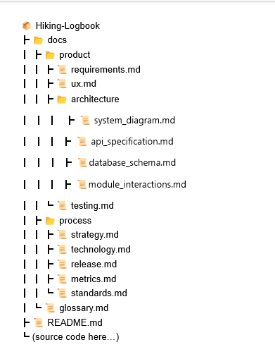

# Hiking Logbook – Documentation

Welcome to the documentation hub for the **Hiking Logbook** project.  
This file serves as a **table of contents** and guide to navigate both **product documentation** (what we are building) and **process documentation** (how we are building).  

> ⚠️ **Note:**  
> This documentation is a **living document**.  
> It may evolve as the project progresses and new requirements, features, or feedback are introduced.  
> All updates will be traceable through Git history.

---

## 📖 Table of Contents

### Product Documentation
1. [Functional & Non-Functional Requirements](docs/product/requirements.md)
2. [UX Documentation](docs/product/ux.md)
3. [Architecture & Design](docs/product/architecture.md)
4. [Testing Documentation](docs/product/testing.md)

### Process Documentation
5. [Strategy Roadmap](docs/process/strategy.md)
6. [Technology Roadmap](docs/process/technology.md)
7. [Release Roadmap](docs/process/release.md)
8. [Metrics](docs/process/metrics.md)
9. [Standards](docs/process/standards.md)

### Additional Sections
10. [Glossary](docs/glossary.md)

---

## 🗂 Documentation Structure

                                                            

---

## 📌 Documentation Standards

- **File Format**: Markdown (`.md`) for readability on GitHub and easy conversion to PDF if required.  
- **Naming Conventions**: Lowercase filenames with underscores if needed (e.g., `architecture_design.md`).  
- **Cross-Referencing**: Each requirement is traceable to UX artifacts, architecture components, and test cases.  
- **Versioning**: Documentation evolves with each sprint and release. Previous versions are tracked in Git history.  

---

## 📊 Metrics Approach

To measure project quality and progress, we track:
- ✅ Story points completed per sprint.  
- ✅ Number of test cases written vs. passed.  
- ✅ Bugs logged and resolved.  
- ✅ Deployment success rate.  

---

## 📚 Glossary

- **Logbook**: A digital record of hikes including notes, weather, and GPS routes.  
- **Planned Hike**: A scheduled hike with route, checklist, and invited friends.  
- **Achievements**: User-defined goals (e.g., total distance, number of hikes) with tracked progress.  
- **Activity Feed**: Timeline showing hikes and milestones from friends.  

---

## 🚀 Purpose of this Documentation

This documentation is designed not just to explain the final product but to demonstrate the **process, quality standards, and intentionality** behind its development. It reflects both the *engineering mindset* and *collaborative teamwork* that went into the Hiking Logbook project.

